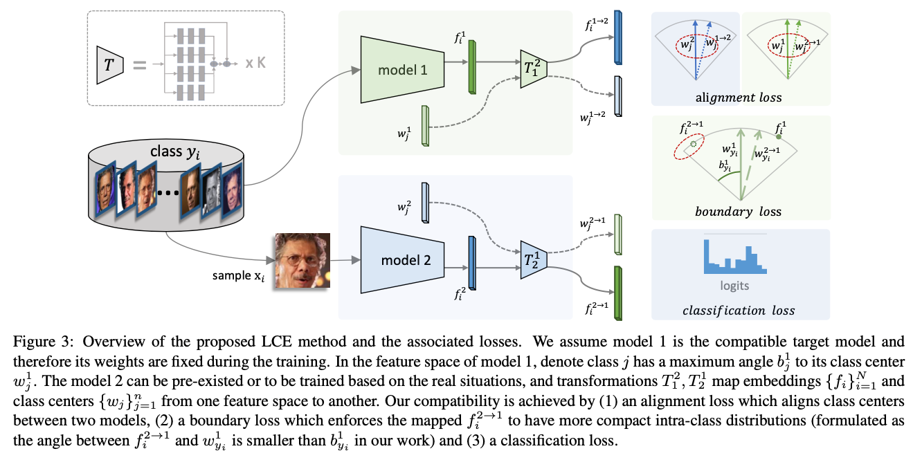

# LCE
Learning Compatible Embeddings, ICCV 2021

by [Qiang Meng](https://github.com/IrvingMeng), [Chixiang Zhang](https://github.com/universebh), [Xiaoqiang Xu](https://github.com/APlayBoy/) and [Feng Zhou](http://www.f-zhou.com/)

Paper: [Arxiv](https://arxiv.org/abs/2108.01958)



For the interests of the company, we cannot share the source codes publicly.
This repo (modified from https://github.com/guxinqian/Simple-ReID) contains the codes for the ReID experiments and contains the core modules/steps.
It should be not hard to implement the method based on given codes. 


## Bibtex
```
@inproceedings{meng2021lce,
  title={Learning Compatible Embeddings},
  author={Meng, Qiang and Zhang, Chixiang and Xu, Xiaoqiang and Zhou, Feng},
  booktitle=ICCV,
  year=2021
}
```

## An example

1. Prepare the Market1501 dataset
2. Train the base model by `./scripts/train.sh`.
3. Train the LCE model by `.scripts/train_lce.sh`.
4. Evaluate the performances by `./scripts/test.sh`.

